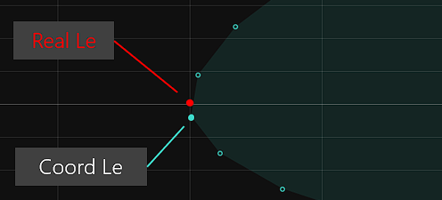
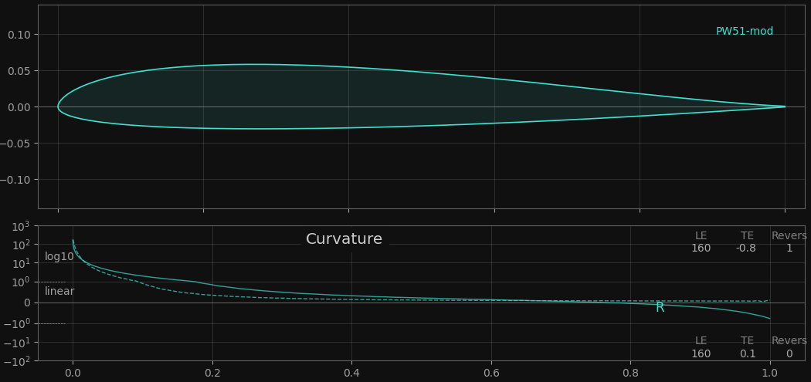

# Geometry of an Airfoil 
{: .no_toc }

This chapter covers the basic geometric properties of an airfoil. Although some aspects may seem familiar, it is essential to understand concepts such as 'panelling' or 'curvature' for successful airfoil optimization.
{: .fs-6 .fw-300 }

Depending on the perspective, the coordinate points of an airfoil can be interpreted differently: 
-	as a set of coordinate points 
-	as a definition of 'panels'
-	or as data points of a spline describing the shape


## Table of contents
{: .no_toc .text-delta }

1. TOC
{:toc}

---

## Coordinate Points

An airfoil has n coordinate points in an x,y-coordinate system. The x-axis represents the airfoils chord line. 


The coordinate points of a '.dat' file describe the airfoil starting at the top of the trailing edge with point 1, moving forward to the leading edge, and then running down the bottom to the trailing edge with point n. The leading edge is defined by the coordinate point with the smallest x-value. Typically, the leading edge has a value of x=0, y=0. 

The two points at the trailing edge, 1 and n, either coincide at x=1, y=0 or define the trailing edge gap by a y-value other than 0.

### Normalizing the coordinates 

During 'normalization' the coordinate points are shifted, stretched or rotated so that the leading edge is precisely at x=0, y=0 and the trailing edge is at x=1 with a symmetric y-value (trailing edge gap). 
This normalization of the coordinate points is a form of first-degree normalization, as opposed to normalization based on the 'true' leading edge (see below).

## Panels 

The connection line between two coordinate points is referred to as a 'panel'. Collectively, they approximate the contour of an airfoil through small straight sections.


These panels are crucial for the aerodynamic calculation with Xfoil, which is why the calculation is also referred to as a panel method. The length of a panel and the angle difference between two adjacent panels are significant factors for the accuracy and quality of the Xfoil calculation. 

In particular, the angle difference of two adjacent panels should not exceed a maximum value, which is also why the panel length is reduced in areas of high curvature to decrease the angle difference. 
Reducing the panel length, especially at the leading edge, is called 'bunching' and is essential for a more accurate aerodynamic calculation.

### The more the better? 

One may be tempted to increase the number of panels to improve the accuracy of the Xfoil calculation. However, comparing the Xfoil results of an airfoil with 160, 200, or 240 panels, only minor differences will be observed in the main section of the polar. 

Differences mainly occur in the high or negative alpha range where the leading edge plays a crucial role. As a general rule, the higher the panel density at the leading edge, the higher the cl max. The question remains unanswered as to which polar is more realistic, as Xfoil tends to provide too optimistic cl-max values. 

Close to the trailing edge it is also advantageous to reduce the panel length to account for potentially higher pressure gradients on the upper or lower side. The option `te_bunch` specifically affects only the last panels just before the trailing edge, allowing for targeted influence.

The disadvantage of a high panel count is that the Xfoil computation time grows approximately proportional to the number of panels. As the time for an optimization run mainly depends on the Xfoil calculations, the panel count determines the time of an overall optimization run. 

Rules of thumb
-	 try to use a lower panel count. 160 panels are a fine all-around value.
-	 increase the `le_bunch` when the number of panels is reduced. A 'le_bunch' of 0.85 for 160 panels is a good starting point.  

### Panelling Options

The input file  allows with several options to control the panelling of the seed airfoil prior to optimization 

```fortran
&panelling_options                               ! options for re-panelling before optimization 
  npan             = 160                         ! no of panels of airfoil
  npoint           = 161                         ! alternative: number of coordinate points
  le_bunch         = 0.86                        ! panel bunch at leading edge  - 0..1 (max) 
  te_bunch         = 0.6                         ! panel bunch at trailing edge - 0..1 (max) 
/
```

The default values are based on many years of experience and do not need to be changed for typical optimization tasks.

## Airfoil as a Shape 


To obtain an airfoil as a curve, a cubic spline is generated that uses the coordinate points as data points. The spline allows to determine any intermediate points with high precision. For example this is used to determine the exact high point of the thickness distribution. 

Xoptfoil2 uses its own spline implementation and does not use Xfoils geometry routines. 

### Exact normalization of an airfoil 

The spline plays a special role in determining the exact leading edge of an airfoil, which can deviate minimally from the leading edge of the airfoil coordinates (smallest x value). 

The leading edge of the curve spline is defined as the point at which the normal vector runs exactly through the trailing edge. 

{:width="50%"}

When normalizing '2nd order', the airfoil is rotated and stretched so that the leading edge of the curve is exactly x=0 and y=0. The coordinate points are then also shifted so that their foremost point is also at x=0, y=0. 

The '2nd order normalization' of an airfoil is an important basis for comparative airfoil assessments. Therefore, when preparing the initial seed airfoil for an optimization, it is checked whether the airfoil is normalized in this way and, if necessary, such a normalization is carried out.
 
## Curvature of an Airfoil   

The curve curvature or the curvature of the airfoil surface is perhaps the most important geometric property of an airfoil. Mathematically, the curvature is the reciprocal of the curve radius of the circle that is tangential to this point. 

The curvature at the leading edge of the airfoil, which is described by the well-known ‘leading edge radius’, is particularly important. 

The curvature reaches a value between 100 and 500 at the leading edge and then falls continuously towards the trailing edge until it is close to 0, which corresponds to a straight line. 

A positive curvature is described as convex, a negative curvature as concave. 'Normal' airfoils are convex throughout, while special airfoils also have concave parts, such as airfoils with rear-loading, which are concave in the rear part of the bottom side. 
The change from convex to concave is also known as a 'reversal', as the sign of the curvature changes at this point. An important characteristic of an airfoil is therefore whether it has 0 or 1 'reversal' on one side of the airfoil.


Curvature of an airfoil with one 'reversal' on the upper side ('reflexed airfoil'). The curvature becomes negative at approx. x=0.85. Due to the high
 curvature values at the leading edge, the curvature value is displayed logarithmically.
{: .fs-2}

As the curvature is also a kind of magnifying glass for the airfoil surface, the curvature can also be used to assess the geometric airfoil quality with X-ray vision.  

### Spikes in the curvature 

Quite often the curvature of an existing airfoil is not even and smooth, but rather resembles a low mountain range, as in this example: 


The cause of these spikes are only 5 or 6 decimal places in the coordinates of the '.dat' file. These (small) curvature spikes usually have no influence on the Xfoil calculations but make it difficult to recognize a real curvature reversal. 

A reversal is detected based on a threshold value, which has a default value of 0.1. If this value is increased to 0.5, for example, significantly fewer or none of these jags are detected. However, there is also a greater risk that genuine reversals will no longer be recognized. 

{: .tip }
In case of 'spikes', smooth the airfoil before the actual optimization run with the `smooth_seed` option. This is particularly advisable when using `hicks-henne` shape functions.


### Trailing edge artefacts

There are airfoils where the curvature at the trailing edge is growing rapidly. This growth of curvature happens typically at the last 5% or 10% of the chord and indicates a little aerodynamic spoiler at trailing edge. The problem is: You can't see it with the naked eye as these artefacts are really small in x,y coordinates.

Xfoils aerodynamic calculation reacts very sensible to such mini 'spoiler' either on top or bottom side of the airfoil leading to remarkable improvements in the results. 

In fact a number of well known airfoils have such a 'spoiler' a trailing edge. Either by accident when creating an airfoil by 'inverse design' - or by design.


Because such a trailing edge 'spoiler' has quite an influence on the aerodynamic results, an optimizer likes to create such a spoiler to improve the results. Based on the assumption that such an artifact can neither be implemented structurally nor has any influence in the real flow, Xoptfoil2 attempts to prevent these spoilers. 

The detection of such an trailing edge artefact is made via the curvature value at trailling edge. The maximum curvature a trailing edge can either be a fixed value using the option `max_te_curvature` or automatically determined by the `auto_curvature` based on the existing value of the seed airfoil. 

During optimization `max_te_curvature` will become a geometric constraint for a new design. When `show_details` is activated, the number of this type of constraint violations is printed as `max_te_curv`.

Have in mind that there is again a 'garbage in, garbage out' situation. So if the seed airfoil already has this artefact, it is not possible to get rid of them through optimization. In such a case other try the option `smooth_seed` or choose another seed airfoil.


### Leading edge artefacts 

Although trailing edge artefacts are more prominent, attention should be paid to the leading edge in case of high lift optimization where the leading edge (curvature) plays a central role. 

The suction peak and the very early transition point are extremly sensible to curvature artefacts typically below the first 1% of chord length. Micro changes of the curvtaure in this area will influence significantly Xfoils high lift results close to cl max. 


It turned out that especially curvature oscillations within the first 5 coordinate points have some kind of a 'turbulator effect' improving cl max of the airfoil. 

Again the `check_curvature` option tries to take care of a smooth curve shape at leading edge by activating an additional (internal) curvature constraint. 

When `show_details` is activated, the number of this type of constraint violations is labeled as `le_curv_monoton`. 
