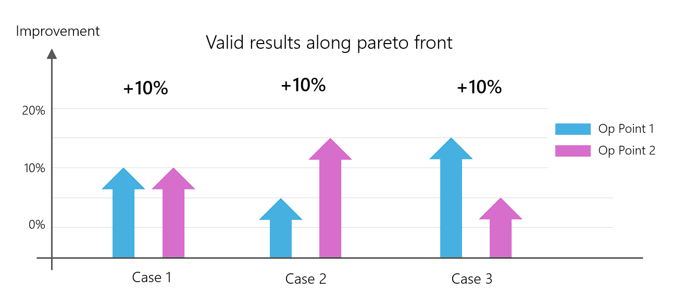
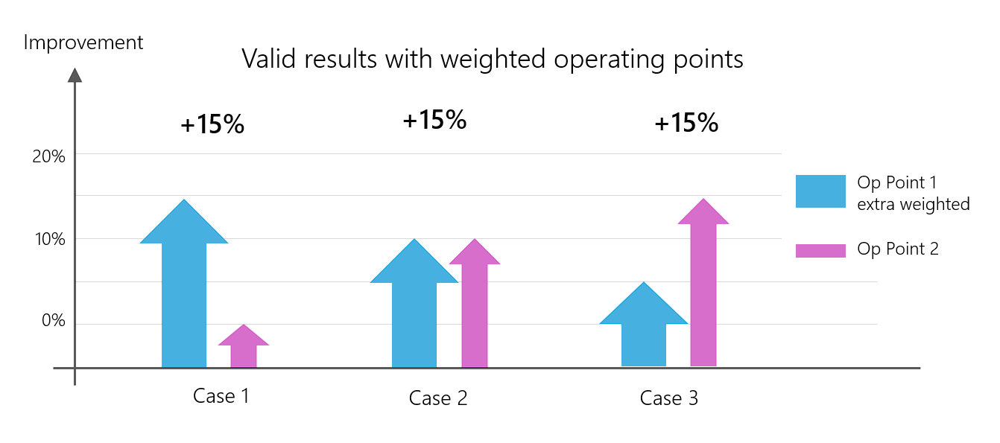
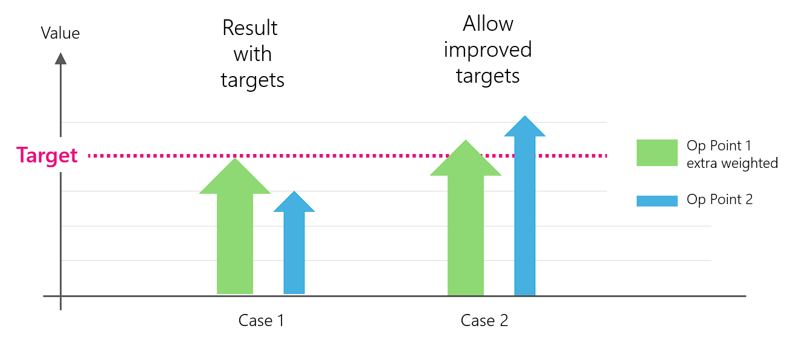
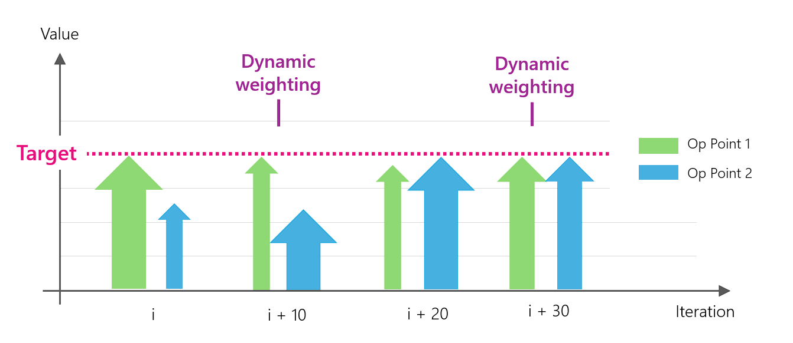

# Optimization Task 
{: .no_toc}

In this chapter, we will learn how to define the actual optimization task for Xoptfoil2.  The previous chapters should have been well understood.
{: .fs-6 .fw-300 }


### Table of contents
{: .no_toc .text-delta }

1. TOC
{:toc}

---


## Aerodynamic Objectives

The aerodynamic objectives of the optimization are defined with the help of so-called 'operating points', each of which defines a point on a polar curve of the airfoil. 

For an 'operating point', it is then defined which property is to be changed by the optimization and how. The most common specification is: 'Minimize drag' at this operating point. 

Depending on the degrees of freedom (number of design variables) resulting from the selected #shape function, 3 to a maximum of 15 operating points are or must be defined in order to achieve optimum results. 
Choosing the right operating points and defining the appropriate optimization target for this point is the key to successful airfoil optimization. 

### Defining an Operating Point

Two parameters are sufficient to clearly define an operating point on a polar curve:
- the Re-number   
- the angle of attack 'alpha' or alternatively the lift coefficient cl

In most cases, better results are achieved if the operating point is defined on the basis of the lift coefficient cl. This is also the default for an operating point.

In the case of an 'alpha' operating point, it can happen that the optimizer wants to 'sneak' a low drag coefficient cd by reducing the lift.  However, an 'alpha' operating point is needed if the objective is to optimize cl-max, i.e. cl is the value to be optimized. 

To specify the Reynolds number of the operatings points, there are several convinience paramters to set default Re numbers values. The special option `re_default_as_resqrtcl` allows to use T2 polars as the base of optimization. In case of T2 (constant lift polar) the Re number is interpreted as Re*sqrt(cl)  


```fortran
&operating_conditions                            ! options to describe the optimization task

  re_default             = 400000                ! use this Reynolds number for operating points
  re_default_as_resqrtcl = .false.               ! interpret re number as type 2 (Re*sqrt(cl)) 
  mach_default           = 0.0                   ! use this Mach number for operating points 

/
```
{: .lh-tight }

Once an 'operating point' has been defined on a polar curve, the optimization objective for this point is now defined. 


### Min/Max Objectives  

A typical optimization objective is to minimize or maximize an aerodynamic coefficient value of the operating point. The kind of the objective is defined by the option 'optimzation_type'. 
For a min/max optimization, possible values for this option are


| `optimization_type`| Description                               |
|:-------------------|:------------------------------------------|
|  `min-drag`        | Minimize drag - more correctly: minimize the drag coefficient cd  |
|  `max-glide`       | Maximize glide ratio 'cl/cd'. This is equivalent to 'min_drag' if the operating point is defined on the basis of cl  |
|  `min-sink`       | Minimize the sink rate cl³/cd² |
|  `max-lift`        | Maximize lift - more correctly maximize the lift coefficient cl. Only makes sense if the operating point is defined on the basis of alpha |
|  `max-xtr`         | Move the laminar-turbulent transition location as far towards the trailing edge as possible. The mean value of upper and lower side is taken as the objective|

Min/max objectives should be used as sparingly as possible, as operating points usually have competing objectives and the optimization results are then no longer deterministic (see Pareto Front).  

### Target Objectives 

Target objectives are more powerful and more versatile than min/max objectives. A `target_value` is specified for the operating point. If this `target_value` is reached during optimization, the optimizer can concentrate on the other operating points, so to speak, which leads to more reproducible results overall.

| `optimization_type`| Description                               |
|:-------------------|:------------------------------------------|
|  `target-drag`     | Drag coefficient cd to be achieved for this operating point |
|  `target-glide`    | Glide ratio cl/cd to be achieved for this operating point. This is equivalent to `target-drag` if the operating point is defined on the basis of cl. |
|  `target-moment`   | Moment coefficient cm to be achieved for this operating point|

The default behaviour is that the target values may also be exceeded by an operating point ('allow_improved_target = .true.'). In rare cases, it can be useful to reach a target value exactly and not to exceed it ('allow_improved_target = .false').

There is a convience option if the `target_value` should be based on the value of the existing seed airfoil: A negative `target_value` is intepreted as a factor the seeds airfoil value - e.g.  `target_value(i) = -1.1` lets the target value be factor 1.1 of the seed airfoil.   


{: .tip }
Reverse engineering

An interesting variant of optimization can be implemented with 'Target Objectives': Reverse engineering of an airfoil. 

To do this, an existing polar curve, for example from a publication, is mapped with the help of 5-10 operating points and 'target_drag'. The optimizer then generates the airfoil associated with this polar curve. If the operating points are well chosen, the result is an amazingly good reproduction of the original airfoil. 


### Flap Optimization

A special option is the definition of flaps. The optimization can then either be carried out with a fixed flap angle per operating point - or the flap angle becomes part of the optimization. In this case, each operating point with a flap angle to be optimized requires an additional 'design variable'. 

The definition of an optimization with flaps requires two sections: 
1. definition of the flap position and the hinge line
2. specification per operating point, whether fixed angle or angle to be optimized

```fortran
&operating_conditions                            ! options to describe the optimization task

  use_flap               = .false.               ! activate flap setting or optimization
  x_flap                 = 0.75                  ! chord position of flap 
  y_flap                 = 0.0                   ! vertical hinge position 
  y_flap_spec            = 'y/c'                 ! ... in chord unit or 'y/t' relative to height
  flap_angle_default     = 0.0                   ! default flap angle for all op points

! per operating point 
  flap_angle(1)    = x                           ! flap angle (default: flap_angle_default)
  flap_optimize(1) = .false.                     ! optimize this flap angle 
/
``` 
{: .lh-tight }

Even if the flap angle is to be optimized, a reasonable starting value for the flap angle should be defined so that the initial airfoil can reach the specification value. If, for example, the glide ratio is to be optimized at c=1.6, but the initial airfoil without flaps can only reach cl=1.2, the optimization would already fail during [initialization](#prepare-and-initialize) . Therefore, in this example, the flap angle should initially be set to perhaps 5 degrees.   

### Example 

Some examples of different aerodynamic objectives of operating points 

```fortran
&operating_conditions                            ! some examples for operating points 

  re_default       = 400000                      ! Reynolds number for all operating points
  use_flap         = .true.                      ! activate flap usage 

  noppoint         = 3                           ! we define only 3 operating points

  op_point(1) = 0.2                              ! cl=0.2 as spec_cl is default 
  optimization_type(1) = 'min-drag'              ! minimize cd (drag) at this point 
  reynolds(1) = 300000                           ! individual Re number of this point 

  op_mode(2) = 'spec-al'                         ! operating point based on alpha-value
  op_point(2) = 5.0                              ! alpha = 5.0 degrees
  optimization_type(2) = 'target-glide'          ! target is glide ratio cl/cd  
  target_value(2) = 74.3                         ! objective is a glide ratio of 74.3

  op_point(3) = 1.1                              ! cl = 1.1 as spec_cl is default 
  optimization_type(3) = 'target-drag'           ! target is drag cd  
  target_value(3) = -1.0                         ! try to preserve the value of seed airfoil
  flap_angle(3) = 3.0                            ! set fixed flap angle of 3.0 degrees

/
``` 
{: .lh-tight }


## Geometric Objectives

Geometric objectives work in a very similar way to aerodynamic target objectives. They are used, for example, when the optimized airfoil should have a certain maximum thickness. Or a family of airfoils should have the same maximum camber in order to achieve a common zero lift angle. 

Geometric objectives compete with aerodynamic objectives and are equally weighted in determining the objective function. 

A special feature of geometric objectives is the preset_to_target option, which sets the seed airfoil to the specified target value at the start of the optimization. In many cases, this can significantly speed up the optimization - it can also be useful to ensure that the seed airfoil can reach a defined polar point at all.

### Example 

Some exmaples of different aerodynamic objectives of operating points 

```fortran
&geometry_targets                                ! geometry target exmaple
  ngeo_targets     = 2                           ! no of geometry targets 

  target_type(1)   = 'thickness'                 ! objective is maximum thickness 
  target_geo(1)    = 0.09                        ! target value of 9% to achieve 

  target_type(2)   = 'thickness'                 ! objective is maximum thickness 
  target_geo(2)    = 0.02                        ! target value of 2% camber to achieve 
  weighting_geo(2) = 2.0                         ! higher weighting of this target
  preset_to_target(2) = .true.                   ! preset seed airfoil to this target 
/  
``` 
{: .lh-tight }


## Objective function 

### Multi objectives - Pareto Front
{:width="70%"}
### Weighting
{:width="70%"}
### Targets
{:width="70%"}
### Dynamic weighting 
{:width="70%"}


## Example 