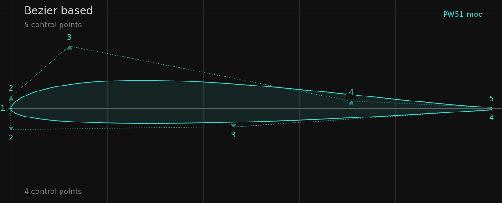

# Shaping Airfoil 

As Xoptfoil2 lore ipsum. 
{: .fs-5 .fw-300 }

## Camber-Thickness

The shape function `camb-thick` uses an airfoils geometry parameters to modify the airfoil. It is the most convinient methodas no care has to be taken for curvature artefacts or geometry constraints violations.

Per default these 6 parameteres - or design variables - of an airfoils geometry are used respectively modified: 

- Thickness 
- Thickness highpoint position 
- Camber   
- Camber highpoint position
- Leading edge radius 
- Leading edge radius blending distance  

Each of these parameters can de-activated so they won't be changed during optimization. 

The shape function `camb-thick` is ideal for getting a quick estimation of the possible capabilties of an existing airfoil which should be adapted for a certain task - or to adapt an airfoil for a new Reynolds number 

(see [the Getting started example]({{site.baseurl}}/getting_started) for more information). 

(see [the Getting started example]({{site.baseurl}}/getting_started/getting_started) for more information). 

(see [the Getting started example]({{site.baseurl}}/getting_started/getting_started.md) for more information). 

As the solution space for new designs is limited it is not advisable to define more than 2,3 or 4 operating points as optimization objectives. In contrast to the shape function `bezier` and `hicks-henne` there is quite seldom a need to define 'helper operating points' to avoid side effects. 

The big advantage of `camb-thick` is the fast convergence of an optimization. Typically after 50 iterat 

## Bezier 
lore ipsum
Some text here

## Hicks-Henne
lore ipsum

## Geometry constraints 
lore ipsum
