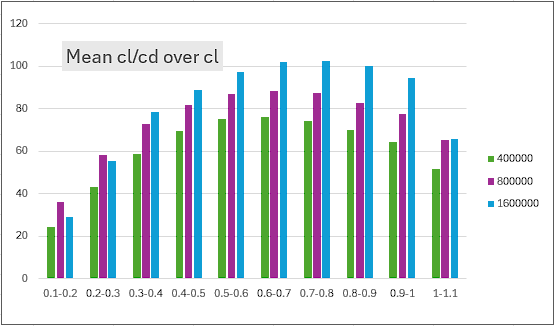

# Run Xoptfoil2

The `worker` is a handy command line tool to do various tasks around airfoil modification and optimization.

Typically it is called within a batch job to automate repeating tasks like setting flap positions and calculating polars for these flapped airfoils. 

```
   worker -w <worker_action> [Options]
```
Following worker actions are supported


```
-w norm           Repanel and normalize an airfoil
-w bezier         Create Bezier based airfoil based on 'match foil' 
-w flap           Set flap at an airfoil – after repaneling and normalizing is done
-w set		      Change max. thickness, max. camber of an airfoil or trailing edge gap
-w blend          Two airfoils are blended by a certain degree
-w polar          Generate polars of an airfoil
-w polar-csv      Generate polars of an airfoil in csv-format
-w check          Check the geometry quality of an airfoil 
-w check-input    Check a Xoptfoil2 input file for errors
```


Additional `[Options]` depend on the respective worker action described in the following sections. 

#### Example

Xfoil_worker -w set t=8.2 -a MH32.dat
… will set the thickness of the airfoil MH32 to 8.2%.

See the following sections for more details.

## Generate polars  (-w polar)

Polars of an airfoil will be generated in Xfoils polar format. The generated polar file is ready to be imported into xflr5 or flow5 via the menu function `Polars / Import Xfoil Polar(s)`.

The polars will be generated in the subdirectory `<airfoil_file>_polars` of the current directory.


   
| Argument                         | Usage     | Description                               |
|:---------------------------------|:----------|:------------------------------------------|
| <nobr>-w polar</nobr>            | mandatory | worker command   |
| <nobr>-a airfoil_file</nobr>     | mandatory | airfoil file  |
| <nobr>-i input_file</nobr>       | mandatory | name of input file which holds the parameters for polar generation  |


The polar is defined via the input file. 

```fortran
&polar_generation                                ! options only for 'Worker'   
  polar_reynolds   = 0                           ! list of reynolds like 100000, 200000, 600000
  polar_mach       = 0                           ! list of mach like 0.1, 0.2, 0.5
  type_of_polar    = 1                           ! either Type 1 or Type 2 polar 
  auto_range       = .false.                     ! best values for mode and range automatically set
  op_mode          = 'spec-al'                   ! range based on alpha or cl 
  op_point_range   = -2, 10, 0.25                ! range start, end, delta 
/

&xfoil_run_options
  ncrit            = 7                           ! ncrit default value for op points 
  xtript           = 1.0                         ! forced transition point 0..1 - top  
  xtripb           = 1.0                         ! forced transition point 0..1 - bot  
  vaccel           = 0.005                       ! xfoil vaccel parameter
/
``` 
{: .lh-tight }

### Example

The following worker command will generate a set of T1 polars for the RG15 airfoil.
The alpha range is automatically determined to include 'cl max' (positve alpha) and 'cl min' (negative alpha). Laminar-turbulent transition is controlled by ncrit=7.


`
worker -w polar -i polars.inp  -a RG15.dat 
`

with the input file 'polars.inp':

```fortran
&polar_generation
  polar_reynolds  = 20000, 50000, 100000, 200000, 500000
  type_of_polar   = 1 
  auto_range      = .true.
/
&xfoil_run_options
  ncrit           = 7                          
/
```
{: .lh-tight }


## Generate polars as csv file (-w polar-csv)

Polars of an airfoil will be generated in an csv format. The generated polar file is ready to be imported into Excel or other programs supporting csv import.

In contrast to `-w polar` the polar data is written and appended to a single file `<airfoil_name>.csv` or `<output_prefix>.csv` which allows to collect the polars of one or many airfoils in a single csv file for common anlysis - see example. 
   
| Argument                         | Usage     | Description                               |
|:---------------------------------|:----------|:------------------------------------------|
| <nobr>-w polar-csv</nobr>        | mandatory | worker command   |
| <nobr>-a airfoil_file</nobr>     | mandatory | airfoil file  |
| <nobr>-i input_file</nobr>       | mandatory | name of input file which holds the parameters for polar generation  |
| <nobr>-o output_prefix</nobr>    | optional  | Alternative file name `<output_prefix>.csv` |


The polar is defined via the input file. 

```fortran
&polar_generation                                ! options only for 'Worker'   
  polar_reynolds   = 0                           ! list of reynolds like 100000, 200000, 600000
  polar_mach       = 0                           ! list of mach like 0.1, 0.2, 0.5
  type_of_polar    = 1                           ! either Type 1 or Type 2 polar 
  auto_range       = .false.                     ! best values for mode and range automatically set
  op_mode          = 'spec-al'                   ! range based on alpha or cl 
  op_point_range   = -2, 10, 0.25                ! range start, end, delta 
/

&xfoil_run_options
  ncrit            = 7                           ! ncrit default value for op points 
  xtript           = 1.0                         ! forced transition point 0..1 - top  
  xtripb           = 1.0                         ! forced transition point 0..1 - bot  
  vaccel           = 0.005                       ! xfoil vaccel parameter
/
``` 
{: .lh-tight }

### Example

The following worker command will generate a set of T1 polars for the RG15 airfoil.
The alpha range is automatically determined to include 'cl max' (positve alpha) and 'cl min' (negative alpha). Laminar-turbulent transition is controlled by ncrit=9, which is the default value.


`
worker -w polar -i polars.inp  -a RG15.dat 
`

with the input file 'polars.inp':

```fortran
&polar_generation
  polar_reynolds  = 400000, 800000, 1600000
  polar_mach      =    0.0,    0.2,     0.5
  type_of_polar   = 1 
  auto_range      = .true.
/
```
{: .lh-tight }

The polar file `RG15.csv` can be imported directly into 'Excel' allowing pivot analysis of the polar data:

{:width="70%"}
A not very meaningful pivot analysis as an example of the possibilities of csv polar files. 
{: .fs-2}
